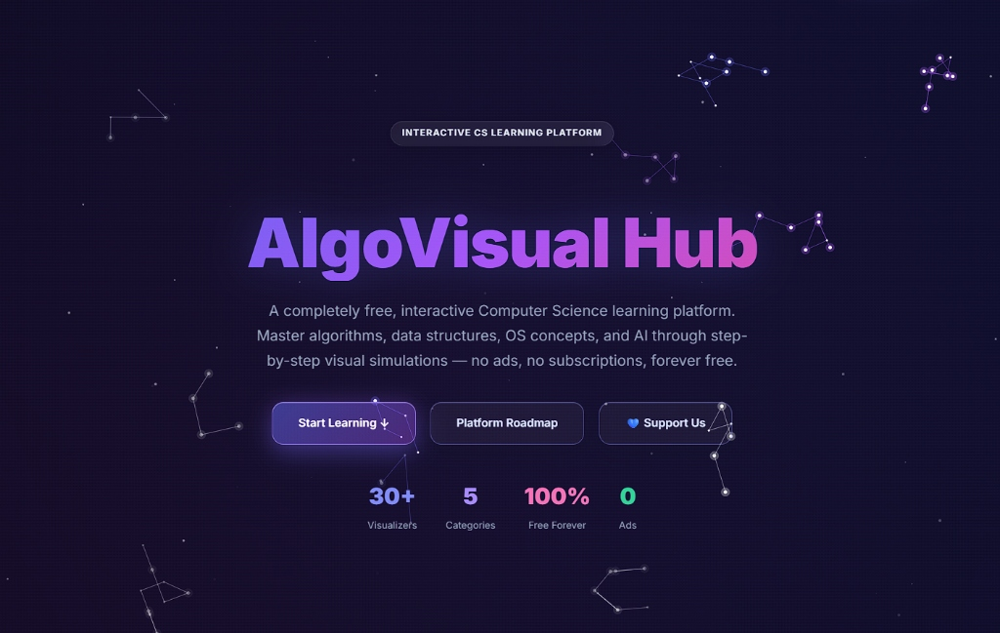
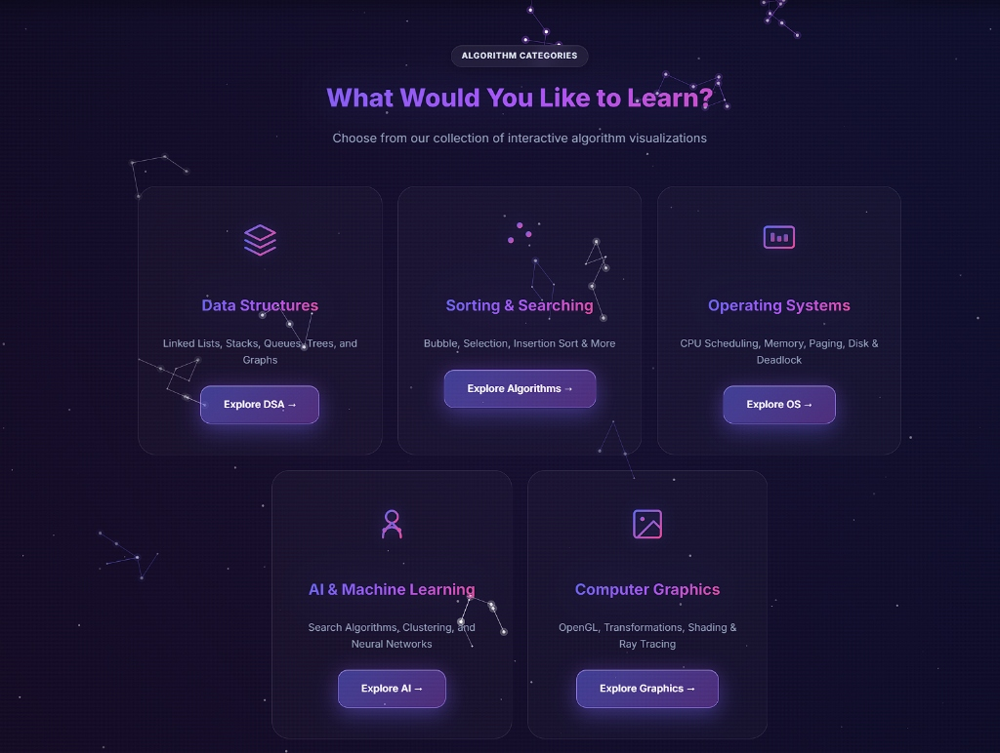

# AlgoVisual Hub 🚀

🌐 **Live Website:** [cpuos-ae329.web.app](https://cpuos-ae329.web.app/)

Welcome to **AlgoVisual Hub**, an interactive, high-fidelity learning platform designed to make abstract computer science concepts visible, intuitive, and beautiful.

I built this platform from the ground up to solve a problem I faced myself: textbooks and static slides make dynamic computer science systems feel lifeless. My vision is to create a cinematic, state-of-the-art visualizer hub that wows you at first glance and teaches you the core mechanics of complex systems through interaction.

With a meticulously crafted modern "glassmorphic" UI, tailored HSL color palettes, neon accents, floating canvas backgrounds, and smooth micro-animations, the platform represents a new standard for educational web design. 100% free, 100% ad-free, and built to help students learn.

---

## 📸 Platform Gallery

### 1. Landing & Exploration Hub
A visually stunning home screen presenting five comprehensive learning paths. Master everything from data structures to graphics pipeline events.


### 2. State-of-the-Art Visualizers
Every algorithm is equipped with an interactive canvas, live code generation, step-by-step logging, complexity analysis, and custom inputs.


---

## 🧩 Educational Categories

### 📂 Data Structures (DSA)
Interactive canvas rendering for node-based collections:
*   **Linked Lists**: Single, doubly, and circular traversal.
*   **Heaps**: Max/min heap structures visualized simultaneously as trees and flat arrays.
*   **BST & AVL Trees**: Dynamic balancing rotations and tree traversals.

### ⚡ Algorithms & Sorting
*   **Sorting Visualizer**: Swaps for bubble, insertion, selection, quick, merge, and heap sort.
*   **Interactive Challenge Mode**: Test your knowledge! Manually swap elements to sort the array and compete for the optimal move count.
*   **Graph Traversals & Solvers**: Pathfinders using BFS, DFS, Dijkstra, A*, Bellman-Ford, and Minimum Spanning Trees (MST).

### ⚙️ Operating Systems (OS)
Simulates core kernel scheduler routines and hardware interactions:
*   **CPU Scheduling**: Gantt chart visualizations for FCFS, SJF, SRTF, Round Robin, and Priority algorithms.
*   **Memory Management**: Allocation simulators for First-Fit, Best-Fit, and Worst-Fit algorithms.
*   **Disk Scheduling**: Request trace plots showing head movement across cylinders.
*   **Deadlock & Synchronization**: Deadlock detection with Wait-For Graphs and Dining Philosophers semaphore simulations.

### 🧠 AI & Machine Learning (AI)
Interactive models with live data plotting:
*   **K-Means Clustering**: User-injected coordinate data points clustered iteratively.
*   **KNN Classification**: Interactive nearest neighbor mapping.
*   **Linear Regression**: Real-time line fitting for scatter points.
*   **Perceptron**: Visualizing decision boundaries of single-layer neural networks.
*   **Minimax Decision Trees**: Visualized step calculations for game logic.

### 🎨 Computer Graphics (CG)
Visualizes geometry rendering, buffer operations, and API hooks:
*   **Interactive GLUT Demos**: Modular demos for `glutMouseFunc` (clicks/trails), `glutKeyboardFunc` (key tracking/ASCII), and `glutCreateMenu` (color context menu generation).
*   **Double Buffering vs Single Buffering**: Viewport comparison showing why single buffering flickers while double buffering swaps front/back buffers smoothly.
*   **Rasterization & Curves**: DDA, Bresenham line drawing, midpoint circles, clipping, and Bezier curve path calculations.

---

## 🛠️ Key Platform Features

*   **Live Code Generator**: Re-compiles standard C++ / Python / Java on the fly as parameters change.
*   **Interactive Challenges**: Gamification system with achievements saved in localStorage.
*   **Execution Log System**: Detailed, real-time step trackers for deep debugging.
*   **URL Session Sharing**: Instantly share a visualizer's state by copying the URL parameters.
*   **Secure Voluntary Support**: Integrated payment options via Paddle (Mada, Apple Pay, Google Pay, Credit Card) and PayPal on the Support page.

---

## 👤 About the Creator

Hi, I'm **Meelo** (GitHub: [@meelafotaibi](https://github.com/meelafotaibi)). I am a student developer passionate about computer science education and high-performance frontend interfaces.

I spent countless hours designing the styling, timing loops, and graphics rendering engines to ensure the learning experience feels premium and responsive. If this hub has helped you learn, consider supporting the project voluntarily to help keep the server lights on:
👉 **[Support via Credit Card / Apple Pay / Google Pay / Mada](https://cpuos-ae329.web.app/support.html)** (processed securely via Paddle on the site).
👉 **[Support via PayPal](https://www.paypal.com/paypalme/Melioronic)**.

---

## 📂 Architecture Outline

*   `assets/js/core/ui-extras.js`: composition engine assembling visualizer cards dynamically.
*   `assets/js/core/features.js`: tracks gamification achievements and progress.
*   `assets/js/core/playback.js`: custom visualizer simulation playback controls.
*   `assets/js/core/graph-engine.js`: robust canvas graph editor and traverser.

```bash
# Start local dev server
npm run dev
# Run smoke testing suite (automated headless Chrome validation)
node scratch/milestone-smoke-test.mjs
```

🌐 **Live Website:** [cpuos-ae329.web.app](https://cpuos-ae329.web.app/)
